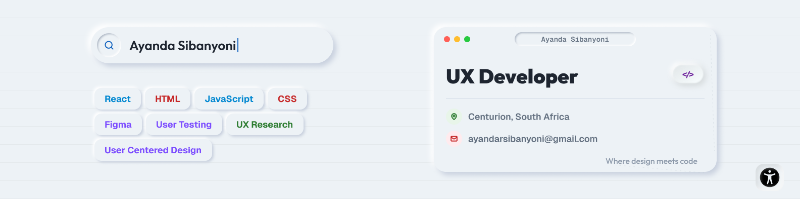

<!-- Ayanda Sibanyoni | UX Developer profile README -->

  

 

  
  
  

## About Me

I'm a UX Developer with experience across **UX design, front-end development and digital products**.

I enjoy understanding the people and problems behind a product, then turning those insights into practical interfaces and working software. My experience includes designing user journeys and interfaces, developing React applications, working with APIs and databases, and maintaining production websites and platforms.

I'm particularly interested in **user-centred design, accessibility, front-end development and creating interfaces that are clear and easy to use**.

I'm also continuously developing my software engineering skills and enjoy working in collaborative environments where I can learn, contribute and solve real problems.

> **Where design meets code.**

## Skills & Technologies

<table>
  <tr>
    <td width="50%" valign="top">
      <h3>UX / UI</h3>
      

        
        
        
        
        
        
        
        
      

    </td>
    <td width="50%" valign="top">
      <h3>Front-End</h3>
      

        
        
        
        
        
        
      

    </td>
  </tr>
  <tr>
    <td width="50%" valign="top">
      <h3>Back-End & Data</h3>
      

        
        
        
        
        
        
      

    </td>
    <td width="50%" valign="top">
      <h3>Tools & Workflow</h3>
      

        
        
        
        
        
        
        
        
      

    </td>
  </tr>
</table>

## What I Work On

- Designing and developing responsive web applications
- Translating UX research and requirements into working interfaces
- Building reusable React components
- Working with APIs, authentication and databases
- Improving existing websites and digital platforms
- Considering accessibility and usability throughout the development process

## Highlights

- **1st Place**: GirlCode & Chenosis No-Code Hackathon
- **Top 50**:1st semester WeThinkCode_ Student
- Experience working across **UX and software development**
- Experience building platforms used by **hundreds of students**

## 📚 Currently Learning

🎓 **Higher Certificate in Mathematics & Statistics (NQF 5)** : UNISA *(Currently completing)*
 
🎨 **Google UX Design Professional Certificate** : Completed

Continuing to grow across **software development, UX design and accessibility**.

## Pacman Contribution Graph

  <picture>
    <source media="(prefers-color-scheme: dark)" srcset="https://raw.githubusercontent.com/Ayander/Ayander/output/pacman-contribution-graph-dark.svg">
    <source media="(prefers-color-scheme: light)" srcset="https://raw.githubusercontent.com/Ayander/Ayander/output/pacman-contribution-graph.svg">
    
  </picture>

## Let's Connect

  
  

 

  <strong>Design with purpose. Build with care. Keep learning.</strong>

